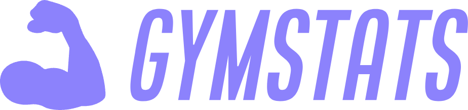

<!-- PROJECT LOGO -->
 

  

  <h3 align="center">GymStat</h3>

  

    Веб-приложение для ведения тренировок.
     
    <a href="https://system.orange-city.ru"><strong>Открыть сайт »</strong></a>
     
  

<!-- TABLE OF CONTENTS -->

  
Содержание

  <ol>
    <li>
      <a href="#about-the-project">Описание проекта</a>
      <ul>
        <li><a href="#built-with">Built With</a></li>
      </ul>
    </li>
    <li>
      <a href="#getting-started">Getting Started</a>
      <ul>
        <li><a href="#prerequisites">Prerequisites</a></li>
        <li><a href="#installation">Installation</a></li>
      </ul>
    </li>
    <li><a href="#usage">Usage</a></li>
    <li><a href="#roadmap">Roadmap</a></li>
    <li><a href="#contributing">Contributing</a></li>
    <li><a href="#license">License</a></li>
    <li><a href="#contact">Contact</a></li>
    <li><a href="#acknowledgments">Acknowledgments</a></li>
  </ol>

## Описание проекта

[![Product Name Screen Shot][product-screenshot]](https://example.com)

Проект представляет собой веб-приложение, которое позволяет записывать результаты тренировок, вести аналитику и ставить личные цели.

Особенности приложения:
* Возможность добавления собственных упражнений
* Автоматизированное заполнение результатов тренировок с помощью шаблонов
* Возможность анализировать результаты отдельно взятых приложений

(<a href="#readme-top">Вверх</a>)

### Использованные технологии
* [![Python][Python-shield]][Python-url]
* [![Django][Django-shield]][Django-url]
* [![Django REST Framework][DRF-shield]][DRF-url]
* [![React][React-shield]][React-url]
* [![MUI][MUI-shield]][MUI-url]
* [![PostgreSQL][PostgreSQL-shield]][PostgreSQL-url]
* [![Redis][Redis-shield]][Redis-url]
* [![Docker][Docker-shield]][Docker-url]
* [![GitHub Actions][GitHub-Actions-shield]][GitHub-Actions-url]

(<a href="#readme-top">back to top</a>)

## Использование

Воспользоваться сайтом можно по URL [system.orange-city.ru](https://system.orange-city.ru/)

### Сборка и запуск проекта

Для сборки проекта и его последующего автоматического запуска на сервере необходимо активировать workflow "Deploy to production" в GitHub Actions. Предварительно необходимо добавить следующие GitHub Actions secrets, если они отсутвуют:
* SERVER_HOST
* SERVER_USER
* SSH_PRIVATE_KEY
* DOCKERHUB_USERNAME
* DOCKERHUB_TOKEN
* DJANGO_SECRET_KEY
* EMAIL_HOST_USER
* EMAIL_HOST_PASSWORD
* DEFAULT_FROM_EMAIL

(<a href="#readme-top">back to top</a>)

## Roadmap

- [x] Add Changelog
- [x] Add back to top links
- [ ] Add Additional Templates w/ Examples
- [ ] Add "components" document to easily copy & paste sections of the readme
- [ ] Multi-language Support
    - [ ] Chinese
    - [ ] Spanish

See the [open issues](https://github.com/othneildrew/Best-README-Template/issues) for a full list of proposed features (and known issues).

(<a href="#readme-top">back to top</a>)

<!-- CONTRIBUTING -->
## Contributing

Contributions are what make the open source community such an amazing place to learn, inspire, and create. Any contributions you make are **greatly appreciated**.

If you have a suggestion that would make this better, please fork the repo and create a pull request. You can also simply open an issue with the tag "enhancement".
Don't forget to give the project a star! Thanks again!

1. Fork the Project
2. Create your Feature Branch (`git checkout -b feature/AmazingFeature`)
3. Commit your Changes (`git commit -m 'Add some AmazingFeature'`)
4. Push to the Branch (`git push origin feature/AmazingFeature`)
5. Open a Pull Request

### Top contributors:

(<a href="#readme-top">back to top</a>)

<!-- LICENSE -->
## License

Distributed under the Unlicense License. See `LICENSE.txt` for more information.

(<a href="#readme-top">back to top</a>)

<!-- CONTACT -->
## Contact

Your Name - [@your_twitter](https://twitter.com/your_username) - email@example.com

Project Link: [https://github.com/your_username/repo_name](https://github.com/your_username/repo_name)

(<a href="#readme-top">back to top</a>)

<!-- ACKNOWLEDGMENTS -->
## Acknowledgments

Use this space to list resources you find helpful and would like to give credit to. I've included a few of my favorites to kick things off!

* [Choose an Open Source License](https://choosealicense.com)
* [GitHub Emoji Cheat Sheet](https://www.webpagefx.com/tools/emoji-cheat-sheet)
* [Malven's Flexbox Cheatsheet](https://flexbox.malven.co/)
* [Malven's Grid Cheatsheet](https://grid.malven.co/)
* [Img Shields](https://shields.io)
* [GitHub Pages](https://pages.github.com)
* [Font Awesome](https://fontawesome.com)
* [React Icons](https://react-icons.github.io/react-icons/search)

(<a href="#readme-top">back to top</a>)

<!-- MARKDOWN LINKS & IMAGES -->
[product-screenshot]: images/screenshot.png
[React.js]: https://img.shields.io/badge/React-20232A?style=for-the-badge&logo=react&logoColor=61DAFB
[React-url]: https://reactjs.org/

[Python-shield]: https://img.shields.io/badge/Python-3776AB?style=for-the-badge&logo=python&logoColor=white
[Django-shield]: https://img.shields.io/badge/Django-092E20?style=for-the-badge&logo=django&logoColor=white
[DRF-shield]: https://img.shields.io/badge/Django%20REST%20Framework-A30000?style=for-the-badge&logo=djangorestframework&logoColor=white
[React-shield]: https://img.shields.io/badge/React-20232A?style=for-the-badge&logo=react&logoColor=61DAFB
[MUI-shield]: https://img.shields.io/badge/MUI-007FFF?style=for-the-badge&logo=mui&logoColor=white
[PostgreSQL-shield]: https://img.shields.io/badge/PostgreSQL-4169E1?style=for-the-badge&logo=postgresql&logoColor=white
[Redis-shield]: https://img.shields.io/badge/Redis-DC382D?style=for-the-badge&logo=redis&logoColor=white
[Docker-shield]: https://img.shields.io/badge/Docker-2496ED?style=for-the-badge&logo=docker&logoColor=white
[GitHub-Actions-shield]: https://img.shields.io/badge/GitHub%20Actions-2088FF?style=for-the-badge&logo=githubactions&logoColor=white

[Python-url]: https://www.python.org/
[Django-url]: https://www.djangoproject.com/
[DRF-url]: https://www.django-rest-framework.org/
[React-url]: https://reactjs.org/
[MUI-url]: https://mui.com/
[PostgreSQL-url]: https://www.postgresql.org/
[Redis-url]: https://redis.io/
[Docker-url]: https://www.docker.com/
[GitHub-Actions-url]: https://github.com/features/actions
